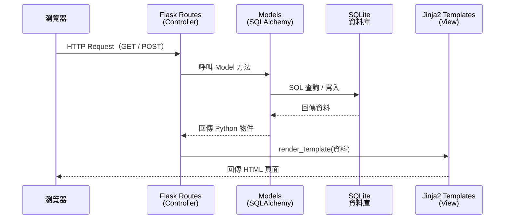

# 系統架構文件（ARCHITECTURE）

**專案名稱：** 讀書筆記本系統  
**文件版本：** v1.0  
**建立日期：** 2026-04-23  
**參考文件：** docs/PRD.md  

---

## 1. 技術架構說明

### 1.1 選用技術與原因

| 技術 | 角色 | 選用原因 |
|------|------|--------|
| **Python Flask** | 後端 Web 框架 | 輕量、易學，適合初學者快速建立 Web 應用 |
| **Jinja2** | 模板引擎（View） | Flask 內建，語法直覺，可在 HTML 中嵌入動態資料 |
| **SQLite** | 資料庫 | 免安裝、單一檔案，適合本地端小型專案 |
| **SQLAlchemy** | ORM（物件關聯對應） | 避免手寫 SQL，防止 SQL Injection，提升可維護性 |
| **Vanilla CSS** | 前端樣式 | 無需額外框架，適合教學環境 |

### 1.2 Flask MVC 模式說明

本專案採用 **MVC（Model-View-Controller）** 架構模式：

| 層次 | 技術 | 負責內容 |
|------|------|--------|
| **Model（模型層）** | SQLAlchemy + SQLite | 定義資料結構、與資料庫溝通、CRUD 操作 |
| **View（視圖層）** | Jinja2 HTML 模板 | 負責畫面渲染，將資料呈現給使用者 |
| **Controller（控制層）** | Flask Routes | 接收 HTTP 請求、呼叫 Model 取得資料、選擇要渲染的 View |

> **簡單比喻：**  
> - Model 是「資料庫管理員」，負責存取資料  
> - View 是「設計師」，負責畫出漂亮的頁面  
> - Controller 是「服務生」，接收點單後去找資料、再端給客人

---

## 2. 專案資料夾結構

```
reading-notes/                  ← 專案根目錄
│
├── app/                        ← 主要應用程式套件
│   │
│   ├── __init__.py             ← 初始化 Flask app，設定資料庫連線
│   │
│   ├── models/                 ← Model 層：資料庫模型定義
│   │   ├── __init__.py
│   │   ├── subject.py          ← Subject（科目）資料模型
│   │   └── book.py             ← Book（書籍）資料模型
│   │
│   ├── routes/                 ← Controller 層：Flask 路由（請求處理）
│   │   ├── __init__.py
│   │   ├── main.py             ← 首頁路由（首頁總覽）
│   │   ├── subjects.py         ← 科目相關路由（新增/列表/刪除）
│   │   └── books.py            ← 書籍相關路由（新增/心得/評分/搜尋）
│   │
│   ├── templates/              ← View 層：Jinja2 HTML 模板
│   │   ├── base.html           ← 共用版型（導覽列、頁首頁尾）
│   │   ├── index.html          ← 首頁：所有科目總覽
│   │   ├── subjects/
│   │   │   ├── list.html       ← 科目列表頁
│   │   │   ├── new.html        ← 新增科目頁
│   │   │   └── detail.html     ← 科目詳細頁（該科目書籍列表）
│   │   └── books/
│   │       ├── new.html        ← 新增書籍頁（含心得與評分）
│   │       ├── detail.html     ← 書籍詳細頁（心得與評分顯示）
│   │       └── search.html     ← 搜尋結果頁
│   │
│   └── static/                 ← 靜態資源
│       ├── css/
│       │   └── style.css       ← 全站樣式
│       └── js/
│           └── main.js         ← 前端互動邏輯（選填）
│
├── instance/                   ← 實例資料夾（Flask 自動建立）
│   └── database.db             ← SQLite 資料庫檔案
│
├── app.py                      ← 程式入口，啟動 Flask
├── requirements.txt            ← Python 套件清單
└── README.md                   ← 專案說明文件
```

---

## 3. 元件關係圖

### 3.1 請求與回應流程



### 3.2 模組依賴關係

```
app.py
  └── app/__init__.py（建立 Flask app + SQLAlchemy）
        ├── app/models/subject.py  ──┐
        ├── app/models/book.py     ──┼── 共用 db 物件
        ├── app/routes/main.py     ──┤
        ├── app/routes/subjects.py ──┤
        └── app/routes/books.py   ──┘
```

---

## 4. 資料模型概覽

> 詳細欄位定義將在 DB Design 文件中說明，此處僅呈現模型間關係。

```
Subject（科目）
  ├── id          主鍵
  ├── name        科目名稱
  ├── description 科目描述（選填）
  └── books       → 一對多關聯到 Book

Book（書籍）
  ├── id          主鍵
  ├── subject_id  外鍵 → Subject
  ├── title       書名
  ├── author      作者（選填）
  ├── rating      評分（1～5）
  ├── review      讀後心得
  └── read_date   閱讀日期
```

**關聯：** 一個科目（Subject）可擁有多本書籍（Book）→ **一對多（1:N）**

---

## 5. 關鍵設計決策

### 決策 1：使用 SQLAlchemy ORM 而非原生 sqlite3
- **原因：** 避免手寫 SQL 字串，防止 SQL Injection；以 Python 物件操作資料庫，程式碼更易讀易維護。

### 決策 2：以「科目」為頂層分類
- **原因：** 符合 PRD 核心需求，學生以科目組織書單，是最直覺的使用心智模型。

### 決策 3：路由依功能模組拆分（subjects.py / books.py）
- **原因：** 避免單一路由檔案過長；每個模組各司其職，日後新增功能也不會互相干擾。

### 決策 4：使用 `base.html` 共用版型
- **原因：** 透過 Jinja2 的 `` 繼承機制，確保所有頁面導覽列、字型、CSS 風格一致，減少重複程式碼。

### 決策 5：搜尋以 GET 表單實作
- **原因：** 搜尋結果可分享 URL（如 `/books/search?q=Python`），符合 RESTful 慣例，也利於書籤收藏。

---

## 6. 頁面與路由對應總覽

| 頁面 | URL | Method | 對應功能 |
|------|-----|--------|--------|
| 首頁總覽 | `/` | GET | 顯示所有科目與書籍數量（F-07） |
| 科目列表 | `/subjects` | GET | 列出所有科目（F-01） |
| 新增科目 | `/subjects/new` | GET / POST | 建立新科目（F-01） |
| 科目書籍列表 | `/subjects/<id>` | GET | 顯示某科目下的書籍（F-06） |
| 刪除科目 | `/subjects/<id>/delete` | POST | 刪除科目（F-01） |
| 新增書籍 | `/subjects/<id>/books/new` | GET / POST | 新增書籍、心得與評分（F-02、F-03、F-04） |
| 書籍詳細 | `/books/<id>` | GET | 顯示書籍心得與評分（F-03、F-04） |
| 書籍搜尋 | `/books/search` | GET | 搜尋書籍（F-05） |
