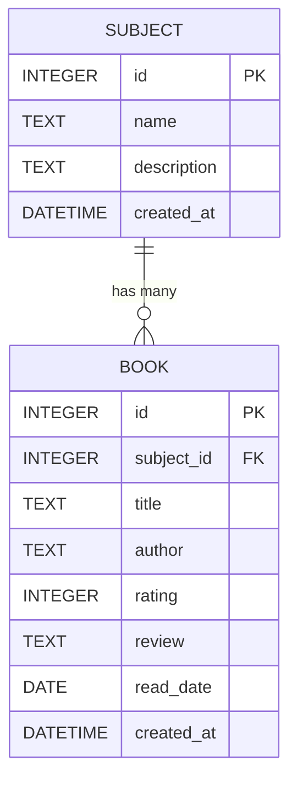

# 資料庫設計文件（DB DESIGN）

## 1. ER 圖（實體關係圖）

## 2. 資料表詳細說明

### 2.1 `subjects` 資料表（科目）

儲存所有讀書科目分類。

| 欄位名稱 | 型別 | 說明 | 必填 | 備註 |
|---------|------|------|------|------|
| `id` | INTEGER | 科目 ID | 是 | Primary Key, Autoincrement |
| `name` | TEXT | 科目名稱 | 是 | 例如：國文、英文、歷史 |
| `description` | TEXT | 科目描述 | 否 | |
| `created_at` | DATETIME | 建立時間 | 是 | 預設為目前時間 |

### 2.2 `books` 資料表（書籍）

儲存書籍紀錄、讀後心得與評分。

| 欄位名稱 | 型別 | 說明 | 必填 | 備註 |
|---------|------|------|------|------|
| `id` | INTEGER | 書籍 ID | 是 | Primary Key, Autoincrement |
| `subject_id` | INTEGER | 關聯的科目 ID | 是 | Foreign Key -> `subjects.id` |
| `title` | TEXT | 書名 | 是 | |
| `author` | TEXT | 作者 | 否 | |
| `rating` | INTEGER | 評分 | 否 | 1～5，代表 1 到 5 顆星 |
| `review` | TEXT | 讀後心得 | 否 | |
| `read_date` | DATE | 閱讀日期 | 否 | ISO 格式 (YYYY-MM-DD) |
| `created_at` | DATETIME | 建立時間 | 是 | 預設為目前時間 |

## 3. SQL 建表語法

請參考 `database/schema.sql`。

## 4. Python Model 程式碼

我們使用 SQLAlchemy 作為 ORM，並實作於以下檔案：
- `app/models/subject.py`
- `app/models/book.py`
