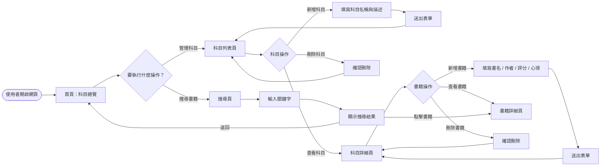
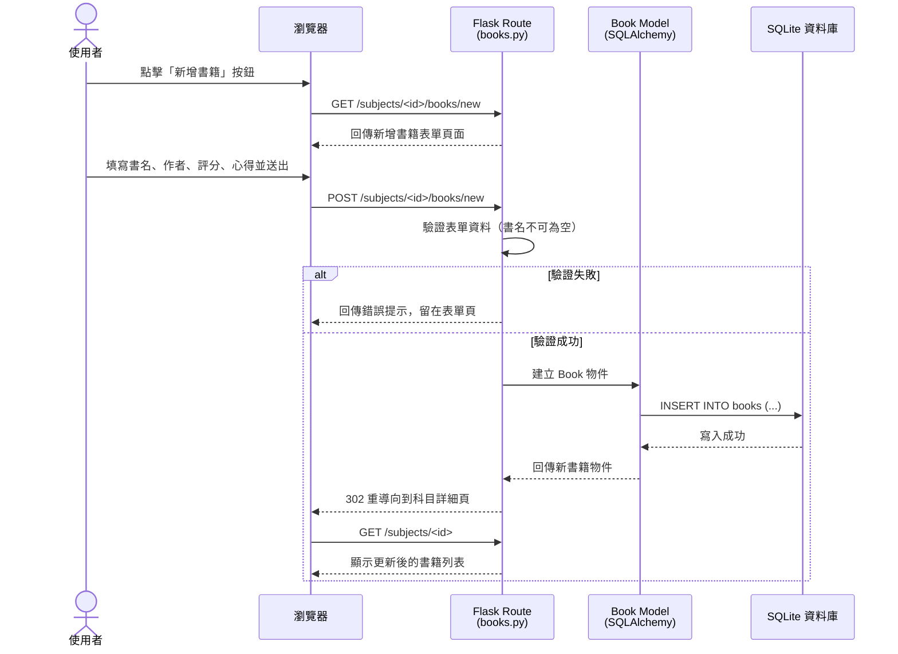
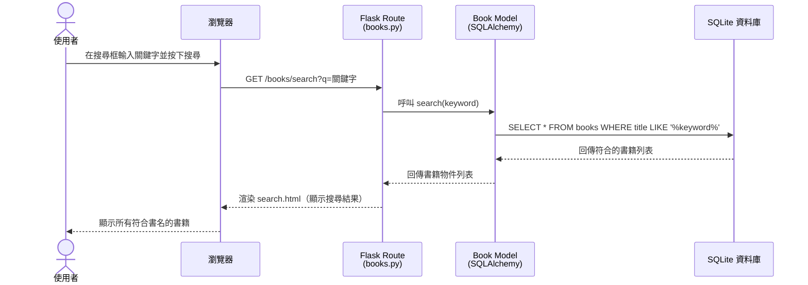
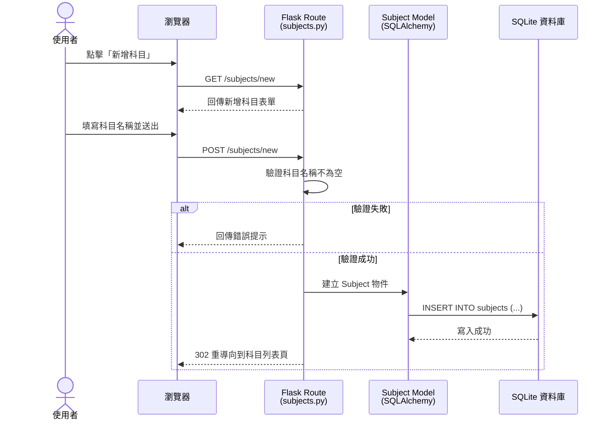
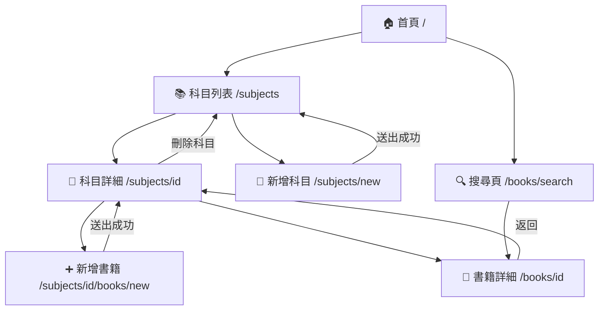

# 流程圖文件（FLOWCHART）

**專案名稱：** 讀書筆記本系統  
**文件版本：** v1.0  
**建立日期：** 2026-04-23  
**參考文件：** docs/PRD.md、docs/ARCHITECTURE.md  

---

## 1. 使用者流程圖（User Flow）

描述使用者從開啟網站到完成各項操作的完整路徑。

---

## 2. 系統序列圖（Sequence Diagram）

以下分別針對「新增書籍」與「搜尋書籍」兩個核心功能，描述系統內部的資料流動。

### 2.1 新增書籍流程

### 2.2 搜尋書籍流程

### 2.3 新增科目流程

---

## 3. 功能清單對照表

| 功能編號 | 功能名稱 | URL 路徑 | HTTP 方法 | 對應 Controller |
|--------|--------|---------|---------|----------------|
| F-07 | 首頁科目總覽 | `/` | GET | `main.py` |
| F-01 | 科目列表 | `/subjects` | GET | `subjects.py` |
| F-01 | 新增科目（表單頁） | `/subjects/new` | GET | `subjects.py` |
| F-01 | 新增科目（送出） | `/subjects/new` | POST | `subjects.py` |
| F-06 | 科目書籍列表 | `/subjects/<id>` | GET | `subjects.py` |
| F-01 | 刪除科目 | `/subjects/<id>/delete` | POST | `subjects.py` |
| F-02、F-03、F-04 | 新增書籍（表單頁） | `/subjects/<id>/books/new` | GET | `books.py` |
| F-02、F-03、F-04 | 新增書籍（送出） | `/subjects/<id>/books/new` | POST | `books.py` |
| F-03、F-04 | 書籍詳細頁 | `/books/<id>` | GET | `books.py` |
| F-05 | 書籍搜尋 | `/books/search?q=<keyword>` | GET | `books.py` |

---

## 4. 頁面轉換關係圖

描述各頁面之間的導覽關係（使用者可以從哪些頁面跳到哪些頁面）。

